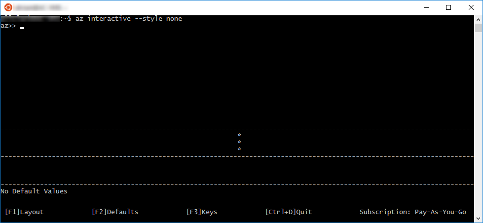

# <a name="interactive-azure-cli-20"></a>交互式 Azure CLI 2.0

通过运行 `az interactive` 命令，能够以交互模式使用 Azure CLI 2.0。
会进入交互式 shell，其中命令会自动完成，有权访问命令说明、参数说明和命令示例。


> [!NOTE]
> 此处并未使用默认样式，也不会在黑色背景下读取。

如果尚未登录帐户，请使用 `login` 命令执行该操作。

## <a name="configure"></a>配置

交互模式会有选择性地显示命令说明、参数说明和命令示例。
使用 `F1` 可打开或关闭说明和示例。


使用 `F2` 可打开或关闭参数默认值显示。



使用 `F3` 可切换某些键笔势的显示。


## <a name="scope"></a>范围

可将交互模式限定为特定命令组，如 `vm` 或 `vm image`。
执行此操作后，将解释此范围内的所有命令。
如果完成了该命令组中的所有工作，说明这是很不错的简写形式。

因此，不需要键入以下命令：

```azurecli
az>> vm create -n myVM -g myRG --image UbuntuLTS
az>> vm list -o table
```

可将范围限定为 vm 命令组，然后键入以下命令：

```azurecli
az>> %%vm
az vm>> create -n myVM -g myRG --image UbuntuLTS
az vm>>list -o table
```

也可将范围限定为较低级别的命令组。
使用 `%%vm image` 可将范围限定为 `vm image`。
在本例中，由于我们已将范围限定为 `vm`，因此使用 `%%image`。

```azurecli
az vm>> %%image
az vm image>>
```

此时，可使用 `%%..` 将范围限制为 `vm`，或者使用 `%%` 将范围限定到根。

```azurecli
az vm image>> %%
az>>
```

## <a name="query"></a>查询

可针对上一次执行命令的结果执行 JMESPath 查询。
例如，创建 VM 后，可确保它已完全设置。

```azurecli
az>> vm create --name myVM --resource-group myRG --image UbuntuLTS --no-wait
az>> ? [*].provisioningState
```

```output
[
  "Creating"
]
```

若要深入了解如何查询命令结果，请参阅[使用 Azure 2.0 查询命令结果](query-azure-cli.md)。

## <a name="bash-commands"></a>Bash 命令

使用 `#[cmd]`，无需退出交互模式即可运行 shell 命令。

```azurecli
az>> #dir
```

## <a name="examples"></a>示例

某些命令具有大量示例。
使用 `CTRL-N` 可滚动到下一页示例，使用 `CTRL-Y` 可滚动到前一页。


还可使用 `::#` 查看特定示例。

```azurecli
az>> vm create ::8
```
